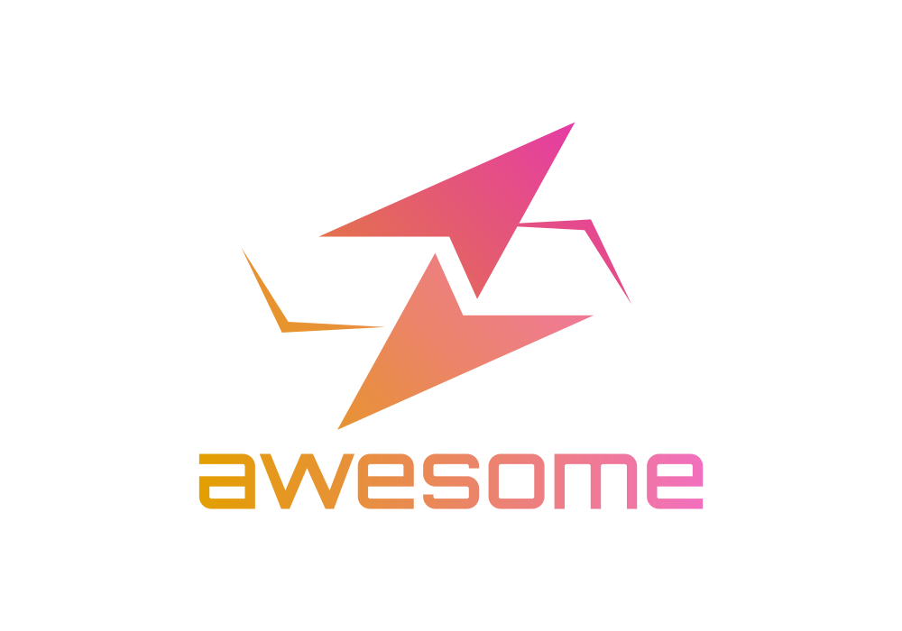

   
  
   

<h1 align="center"><b>Awesome-Molecular-Docking</b></h1>

    
    
    
    
    

We would like to maintain a list of resources which aim to solve molecular docking and other closely related tasks.

We will update this repository regularly.

If you want to add some related works to this repository, please feel free to contact me via yangnianzu@sjtu.edu.cn.

## Table of Contents
- [Table of Contents](#table-of-contents)
- [Related Survey](#related-survey)
- [Dataset](#dataset)
- [Software for Docking](#software-for-docking)
- [Molecule-Protein Docking](#molecule-protein-docking)
- [Protein-Protein Docking](#protein-protein-docking)
- [Molecular Dynamics Simulation](#molecular-dynamics-simulation)
- [Binding Site Identification](#binding-site-identification)

## Related Survey
- [ ] Crampon, Kevin, et al. "Machine-learning methods for ligand–protein molecular docking." Drug discovery today (2021). [[Paper](https://www.sciencedirect.com/science/article/abs/pii/S1359644621003974)]
- [ ] Harmalkar, Ameya, and Jeffrey J. Gray. "Advances to tackle backbone flexibility in protein docking." Current opinion in structural biology 67 (2021): 178-186. [[Paper](https://www.sciencedirect.com/science/article/abs/pii/S0959440X20302141?via%3Dihub)]

## Dataset
- PDBBind
- Structural Antibody Database (SAbDab)
- Database of Interacting Protein Structures (DIPS)

## Software for Docking
- ATTRACT 
- HDOCK
- CLUSPRO
- PATCHDOCK

<!-- [[Paper]()][[Code]()] -->

## Molecule-Protein Docking
- [ ] Corso, Gabriele, et al. "DiffDock: Diffusion Steps, Twists, and Turns for Molecular Docking." arXiv preprint arXiv:2210.01776 (2022). [[Paper](https://arxiv.org/abs/2210.01776)][[Code](https://github.com/gcorso/DiffDock)]
- [ ] Lu, Wei, et al. "TANKBind: Trigonometry-Aware Neural NetworKs for Drug-Protein Binding Structure Prediction." Advances in Neural Information Processing Systems. 2022.[[Paper](https://openreview.net/forum?id=MSBDFwGYwwt)][[Code](https://github.com/luwei0917/TankBind)]
- [ ] Stärk, Hannes, et al. "Equibind: Geometric deep learning for drug binding structure prediction." International Conference on Machine Learning. PMLR, 2022. [[Paper](https://proceedings.mlr.press/v162/stark22b.html)][[Code](https://github.com/HannesStark/EquiBind)]

## Protein-Protein Docking
- [ ] Ganea, Octavian-Eugen, et al. "Independent se (3)-equivariant models for end-to-end rigid protein docking." International Conference on Learning Representations (2022). [[Paper](https://openreview.net/forum?id=GQjaI9mLet)][[Code](https://github.com/octavian-ganea/equidock_public)]

## Molecular Dynamics Simulation
- [ ] Fu, Xiang, et al. "Simulate Time-integrated Coarse-grained Molecular Dynamics with Geometric Machine Learning." arXiv preprint arXiv:2204.10348 (2022). [[Paper](https://arxiv.org/abs/2204.10348)][[Code](https://github.com/kyonofx/mlcgmd)]

## Binding Site Identification
- [ ] Freyr, et al. "Fast end-to-end learning on protein surfaces." Proceedings of the IEEE/CVF Conference on Computer Vision and Pattern Recognition. 2021. [[Paper](https://openaccess.thecvf.com/content/CVPR2021/html/Sverrisson_Fast_End-to-End_Learning_on_Protein_Surfaces_CVPR_2021_paper.html)]
- [ ] Gainza, Pablo, et al. "Deciphering interaction fingerprints from protein molecular surfaces using geometric deep learning." Nature Methods 17.2 (2020): 184-192. [[Paper](https://www.nature.com/articles/s41592-019-0666-6)][[Code](https://github.com/LPDI-EPFL/masif)]

